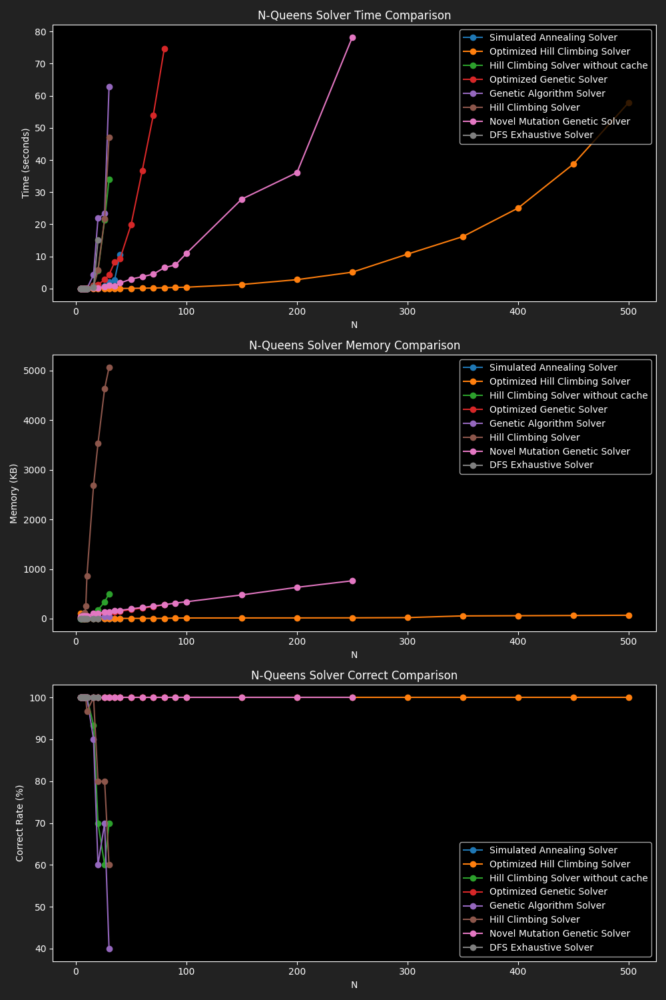

# N-Queens Problem

This project implements and benchmarks multiple algorithms for solving the classic N-Queens problem, which asks for a placement of N queens on an N×N chessboard such that no two queens threaten each other.

## Features

- Multiple solver implementations:
  - DFS Exhaustive Solver
  - Genetic Algorithm Solver
  - Optimized Genetic Solver
  - Hill Climbing Solver
  - Optimized Hill Climbing Solver
  - (Optionally) Simulated Annealing Solver
- Benchmarking framework for time, memory, and correctness
- Visualization of results

## Solvers

- **DFS Exhaustive Solver**: Classic backtracking approach, guarantees a solution if one exists, but is slow for large N.
- **Genetic Algorithm Solver**: Uses evolutionary strategies to search for solutions, faster but may not always find a solution.
- **Optimized Genetic Solver**: Enhanced genetic algorithm with adaptive mutation and population restart.
- **Hill Climbing Solver**: Greedy local search, may get stuck in local minima.
- **Optimized Hill Climbing Solver**: Uses min-conflicts heuristic and multiple restarts for better performance.
- **Simulated Annealing Solver**: (Optional) Probabilistic local search with temperature-based escape from local minima.

## Usage

1. **Install dependencies**:
    ```bash
    pip install poetry
    poetry install
    ```

2. **Run benchmarks**:
    #### Go to this file and see what it runs, it also have RUN_IN_MULTITHREAD if set to True runs solvers in parallel
    ```bash
    python src/banchmark.py
    ```

3. **View results**:
    - Plots and markdown tables are generated in the `src/plots/` directory.
    - Aggregated results are in `src/plots/aggregate_results.md`.

## Benchmark Results

Below are the aggregated benchmark results for all solvers:



### Time Comparison

|N|DFS Exhaustive Solver|Genetic Algorithm Solver|Hill Climbing Solver|Optimized Genetic Solver|Optimized Hill Climbing Solver|
|---|---|---|---|---|---|
|4|0.0000|0.0007|0.0002|0.0011|0.0001|
|8|0.0016|0.0186|0.0177|0.0479|0.0063|
|16|2.1386|11.1973|4.7614|2.7846|0.0267|
|24|178.2766|||||
|26|160.4027|||||
|30||45.9811|220.6207|19.2156|0.0883|
|35|||104.5873|||
|50||152.2743||81.2561||
|100||||329.1825|2.2672|
|150|||||6.5876|
|200|||||13.6865|
|250|||||25.9262|
|300|||||29.6190|
|350|||||70.3217|

### Memory Comparison

|N|DFS Exhaustive Solver|Genetic Algorithm Solver|Hill Climbing Solver|Optimized Genetic Solver|Optimized Hill Climbing Solver|
|---|---|---|---|---|---|
|4|1.9300|11.1300|6.6400|20.2200|1.5900|
|8|2.9600|43.8300|72.7200|72.6400|12.1900|
|16|374.6800|1295.1900|583.3000|630.1600|61.7400|
|24|3817.7400|||||
|26|5151.8700|||||
|30||3429.2600|2949.0500|1812.6400|132.3000|
|35|||2779.9400|||
|50||2248.8800||2542.5200||
|100||||2225.0900|1157.1800|
|150|||||2739.1100|
|200|||||3640.2000|
|250|||||4231.0100|
|300|||||3559.2600|
|350|||||4399.1700|

### Correctness Comparison

|N|DFS Exhaustive Solver|Genetic Algorithm Solver|Hill Climbing Solver|Optimized Genetic Solver|Optimized Hill Climbing Solver|
|---|---|---|---|---|---|
|4|100.0000|100.0000|100.0000|100.0000|100.0000|
|8|100.0000|100.0000|100.0000|100.0000|100.0000|
|16|100.0000|30.0000|100.0000|100.0000|100.0000|
|24|100.0000|||||
|26|100.0000|||||
|30||25.0000|80.0000|100.0000|100.0000|
|35|||50.0000|||
|50||0.0000||100.0000||
|100||||100.0000|100.0000|
|150|||||100.0000|
|200|||||100.0000|
|250|||||100.0000|
|300|||||100.0000|
|350|||||100.0000|

## License

This project is licensed under the MIT License.