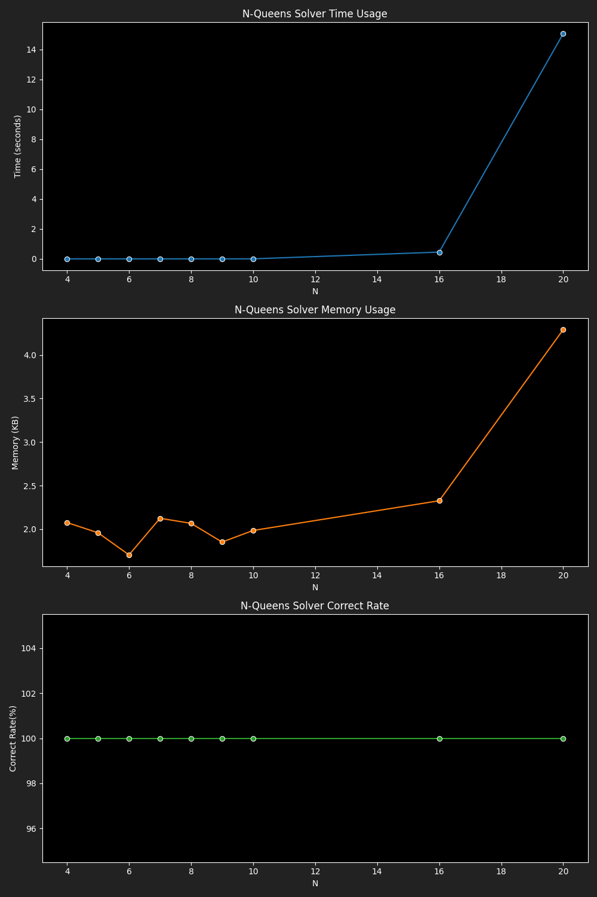

# Benchmark Results for DFS Exhaustive Solver

|  N |4|5|6|7|8|9|10|16|20|26|
|---|---|---|---|---|---|---|---|---|---|---|
|Time|0.0000|0.0000|0.0002|0.0001|0.0014|0.0007|0.0021|0.4534|15.0850|52.6276|
|Memory|2.08|1.96|1.70|2.14|2.05|1.85|1.98|2.32|4.38|4.72|
|Correct Rate|100.00|100.00|100.00|100.00|100.00|100.00|100.00|100.00|100.00|100.00|
