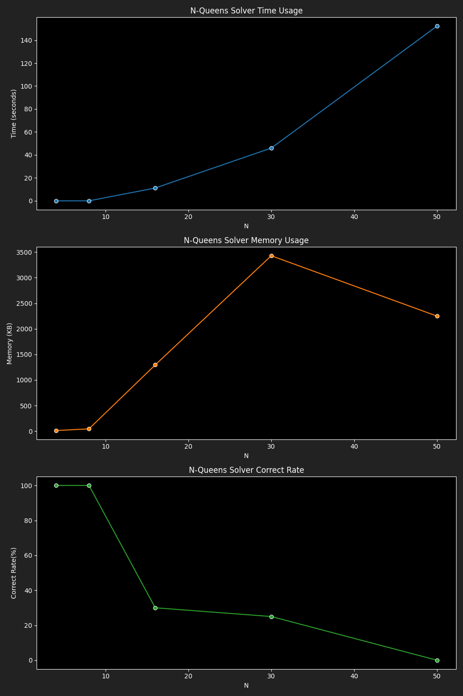

# Benchmark Results for Genetic Algorithm Solver

|  N |4|5|6|7|8|9|10|16|20|26|30|
|---|---|---|---|---|---|---|---|---|---|---|---|
|Time|0.0003|0.0004|0.0025|0.0016|0.0042|0.0090|0.0293|4.3060|21.8897|23.3129|62.7648|
|Memory|10.40|11.96|15.74|16.60|19.00|22.10|23.53|30.71|35.53|39.34|44.16|
|Correct Rate|100.00|100.00|100.00|100.00|100.00|100.00|100.00|90.00|60.00|70.00|40.00|
