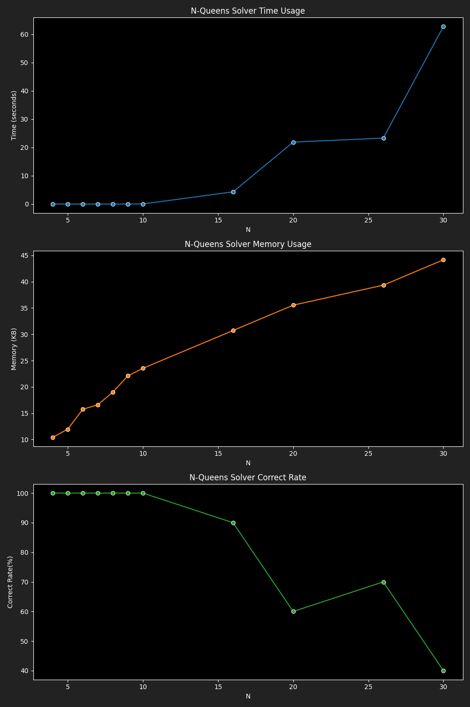

# Benchmark Results for Genetic Algorithm Solver

|  N |4|8|16|30|50|
|---|---|---|---|---|---|
|Time|0.0007|0.0186|11.1973|45.9811|152.2743|
|Memory|11.13|43.83|1295.19|3429.26|2248.88|
|Correct Rate|100.00|100.00|30.00|25.00|0.00|
