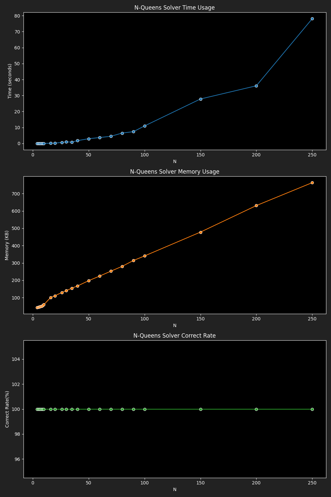

# Benchmark Results for Novel Mutation Genetic Solver

|  N |4|5|6|7|8|9|10|16|20|26|30|35|40|50|60|70|80|90|100|150|200|250|
|---|---|---|---|---|---|---|---|---|---|---|---|---|---|---|---|---|---|---|---|---|---|---|
|Time|0.0062|0.0170|0.0093|0.0088|0.0130|0.0138|0.0238|0.1377|0.2041|0.6295|1.0031|0.8189|1.7511|2.9496|3.7040|4.4851|6.5145|7.3623|10.9447|27.8206|36.0969|78.1325|
|Memory|43.55|45.03|47.11|48.69|50.85|53.97|59.79|100.35|111.14|129.57|140.17|154.71|167.08|197.75|224.77|252.92|280.57|313.98|340.39|477.90|630.91|763.21|
|Correct Rate|100.00|100.00|100.00|100.00|100.00|100.00|100.00|100.00|100.00|100.00|100.00|100.00|100.00|100.00|100.00|100.00|100.00|100.00|100.00|100.00|100.00|100.00|
