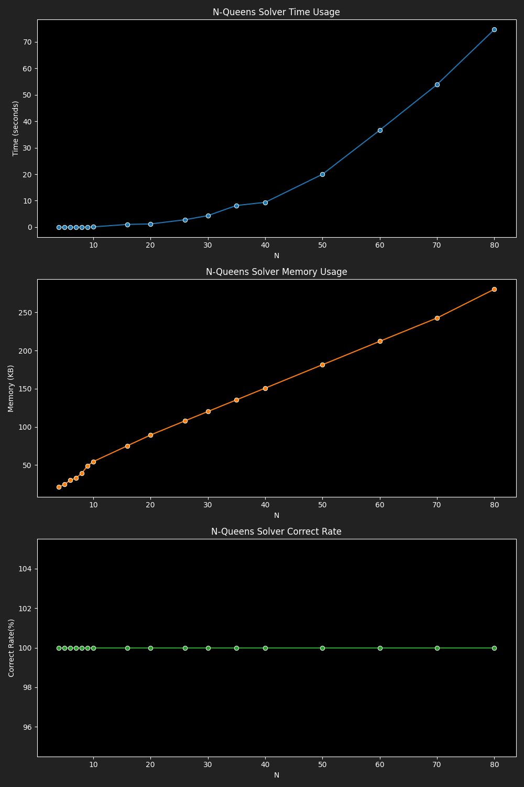

# Benchmark Results for Optimized Genetic Solver

|  N |4|5|6|7|8|9|10|16|20|26|30|35|40|50|60|70|80|
|---|---|---|---|---|---|---|---|---|---|---|---|---|---|---|---|---|---|
|Time|0.0008|0.0008|0.0066|0.0043|0.0132|0.0283|0.0920|1.0354|1.1963|2.7812|4.3419|8.1807|9.3614|19.9681|36.6380|53.8877|74.6825|
|Memory|21.40|24.50|30.18|32.85|39.24|48.73|54.45|75.29|89.30|107.82|120.08|135.40|150.71|181.44|212.15|242.72|280.45|
|Correct Rate|100.00|100.00|100.00|100.00|100.00|100.00|100.00|100.00|100.00|100.00|100.00|100.00|100.00|100.00|100.00|100.00|100.00|
