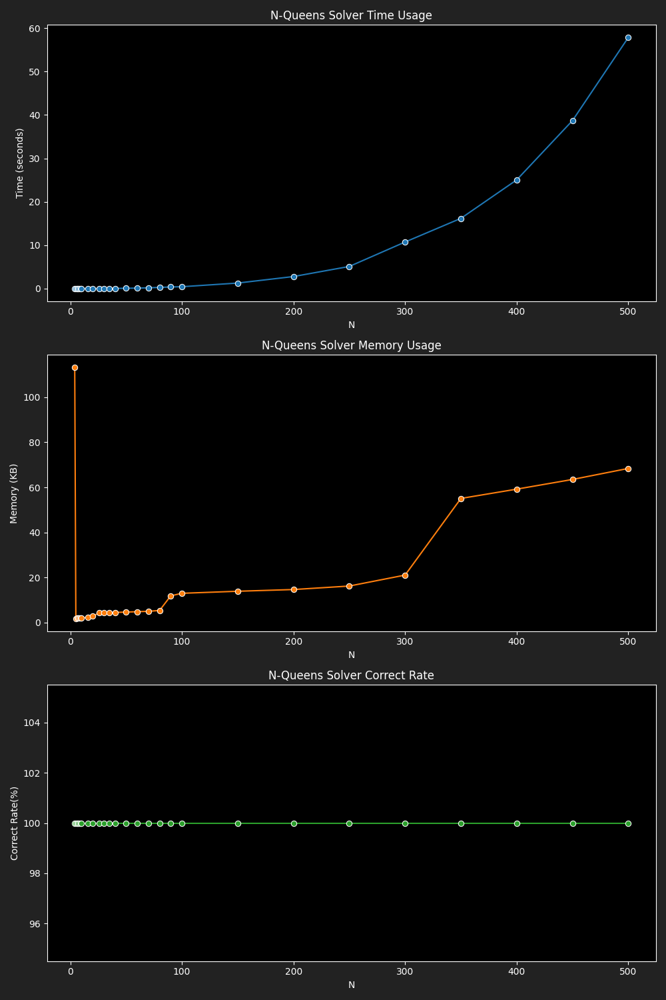

# Benchmark Results for Optimized Hill Climbing Solver

|  N |4|5|6|7|8|9|10|16|20|26|30|35|40|50|60|70|80|90|100|150|200|250|300|350|400|450|500|
|---|---|---|---|---|---|---|---|---|---|---|---|---|---|---|---|---|---|---|---|---|---|---|---|---|---|---|---|
|Time|0.0001|0.0001|0.0028|0.0022|0.0012|0.0037|0.0059|0.0116|0.0081|0.0166|0.0292|0.0331|0.0389|0.0782|0.1115|0.1816|0.2744|0.3767|0.4306|1.2763|2.7771|5.1012|10.7296|16.1814|25.0440|38.7147|57.8543|
|Memory|113.18|1.79|1.99|2.05|2.10|2.20|2.20|2.23|2.82|4.35|4.37|4.49|4.52|4.69|4.86|5.03|5.40|11.88|13.01|13.92|14.68|16.24|21.09|55.08|59.21|63.50|68.39|
|Correct Rate|100.00|100.00|100.00|100.00|100.00|100.00|100.00|100.00|100.00|100.00|100.00|100.00|100.00|100.00|100.00|100.00|100.00|100.00|100.00|100.00|100.00|100.00|100.00|100.00|100.00|100.00|100.00|
