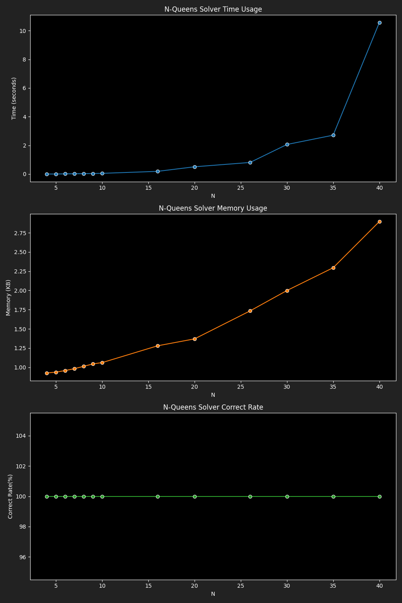

# Benchmark Results for Simulated Annealing Solver

|  N |4|5|6|7|8|9|10|16|20|26|30|35|40|
|---|---|---|---|---|---|---|---|---|---|---|---|---|---|
|Time|0.0005|0.0011|0.0134|0.0188|0.0257|0.0354|0.0482|0.1870|0.5053|0.8063|2.0615|2.7086|10.5637|
|Memory|0.92|0.94|0.96|0.98|1.01|1.04|1.06|1.28|1.37|1.73|2.00|2.30|2.90|
|Correct Rate|100.00|100.00|100.00|100.00|100.00|100.00|100.00|100.00|100.00|100.00|100.00|100.00|100.00|
